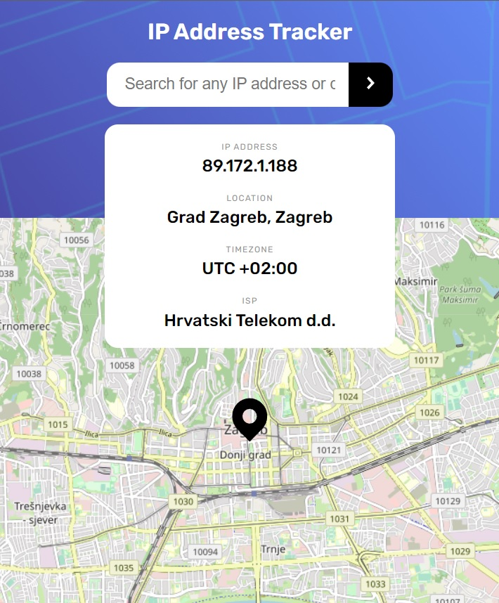

# Frontend Mentor - IP address tracker solution

This is a solution to the [IP address tracker challenge on Frontend Mentor](https://www.frontendmentor.io/challenges/ip-address-tracker-I8-0yYAH0). Frontend Mentor challenges help you improve your coding skills by building realistic projects.

## Table of contents

- [Overview](#overview)
  - [The challenge](#the-challenge)
  - [Screenshot](#screenshot)
  - [Links](#links)
- [My process](#my-process)
  - [Built with](#built-with)
  - [What I learned](#what-i-learned)
- [Author](#author)

## Overview

### The challenge

Users should be able to:

- View the optimal layout for each page depending on their device's screen size
- See hover states for all interactive elements on the page
- See their own IP address on the map on the initial page load
- Search for any IP addresses or domains and see the key information and location

### Screenshot



### Links

- Solution URL: [Add solution URL here](https://github.com/lazo2212/IP_Address_Tracker.git)
- Live Site URL: [IP address tracker - live](https://lazo2212.github.io/IP_Address_Tracker/)

## My process

### Built with

- Semantic HTML5 markup
- (S)CSS custom properties
- Flexbox
- Mobile-first workflow

### What I learned

In this challenge, I learned how to use two separate APIs together to build an IP tracking application. The first API is [IP Geolocation API by IPify](https://geo.ipify.org/) through which you can retrieve data about your location with IP address, domain or email. Second API is [LeafletJS](https://leafletjs.com/) an open-source JavaScript library for mobile-friendly interactive maps where you can easly implement in your project.

An example of fetch data:

```js
{
    "ip": "8.8.8.8",
    "location": {
        "country": "US",
        "region": "California",
        "city": "Mountain View",
        "lat": 37.38605,
        "lng": -122.08385,
        "postalCode": "94035",
        "timezone": "-07:00",
        "geonameId": 5375480
    }
}
```

## Author

- LinkedIN - [Robert Lazić](https://www.linkedin.com/in/robert-lazi%C4%87/)
- GitHub - [Robert Lazić](https://github.com/lazo2212)
- Frontend Mentor - [Robert](https://www.frontendmentor.io/profile/lazo2212)
- email - [robert.lazicpz@gmail.com](robert.lazicpz@gmail.com)
